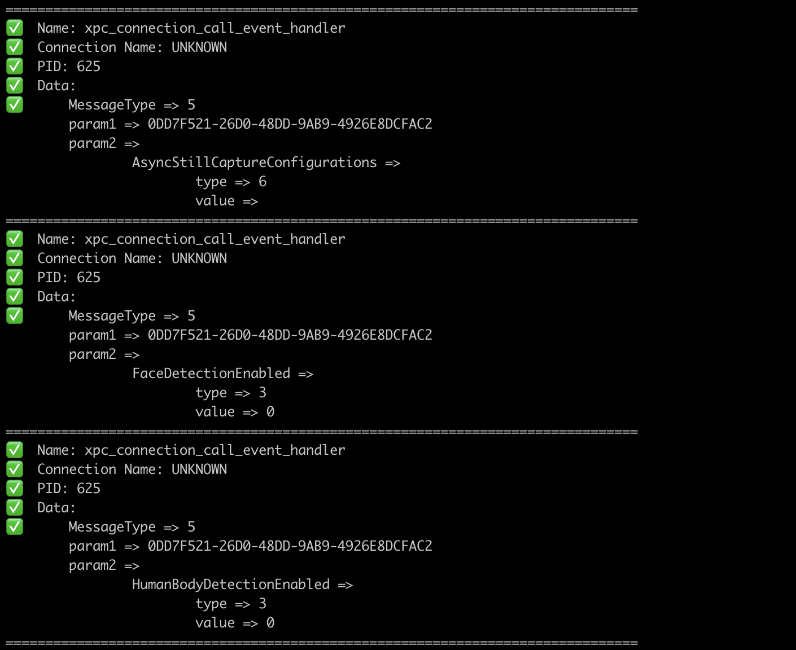
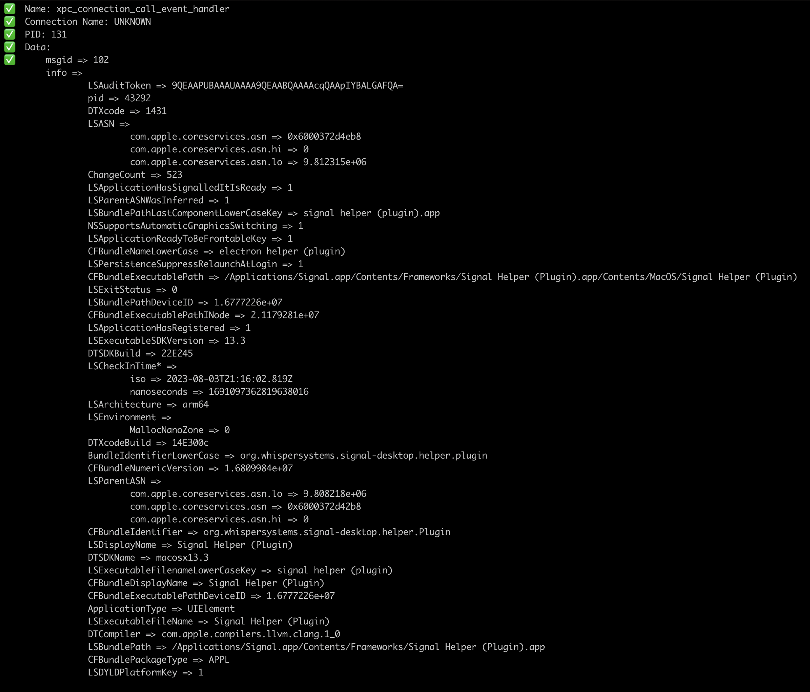
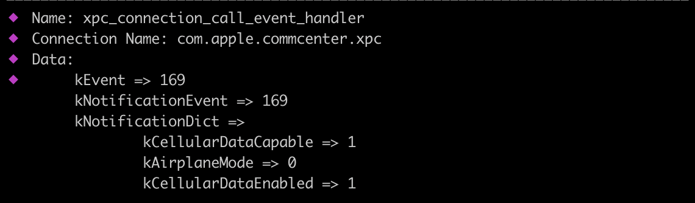

# gxpc

Tool inspired by [xpcspy](https://github.com/hot3eed/xpcspy) tool to monitor XPC traffic. 

gxpc recursively parses types of `xpc_object_t` as well as unmarshalling the data back to Go types.

# Installation

Download one of the prebuilt binaries for macOS(x86_64 or arm64) from [here](https://github.com/nsecho/gxpc/releases) 
or do it manually as described below. 

* Follow the instructions for devkit documented [here](https://github.com/frida/frida-go)
* Run `go install github.com/nsecho/gxpc@latest`

# Usage

```bash
$ gxpc --help
XPC sniffer

Usage:
  gxpc [spawn_args] [flags]

Flags:
  -b, --blacklist strings   blacklist the following wildcard connections
  -f, --file string         spawn the file
  -h, --help                help for gxpc
  -i, --id string           connect to device with ID
  -l, --list                list available devices
  -n, --name string         process name
  -o, --output string       save output to this file
  -p, --pid int             PID of wanted process (default -1)
  -r, --remote string       connect to device at IP address
```







If you do not pass `-i` flag, by default it will use USB device.
